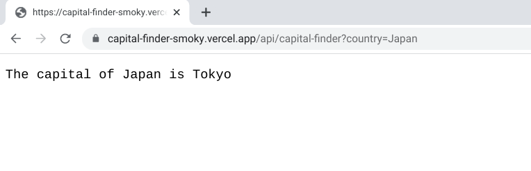
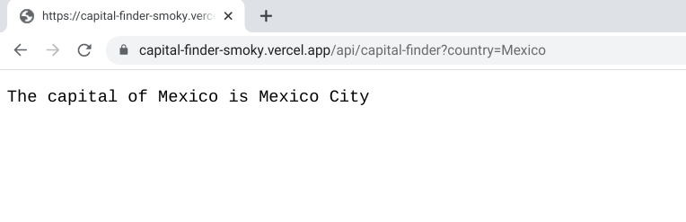
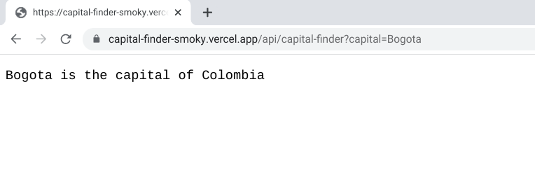
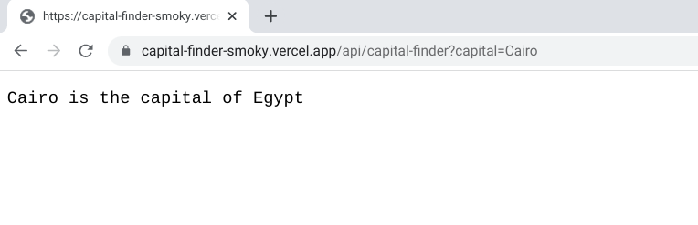

# Capital Finder &middot; 

Serverless function deployed to the cloud (Vercel) that returns the capital of a country or the country of a capital city query.

Interacts with the REST Countries API to obtain the desired information.

### Route and query examples:

1. '/capital-finder?country=Chile' generates an http response: 'The capital of Chile is Santiago'
2. '/capital-finder?capital=Santiago' generates an http response: 'Santiago is the capital of Chile'.

#### Screenshots of deployed examples

